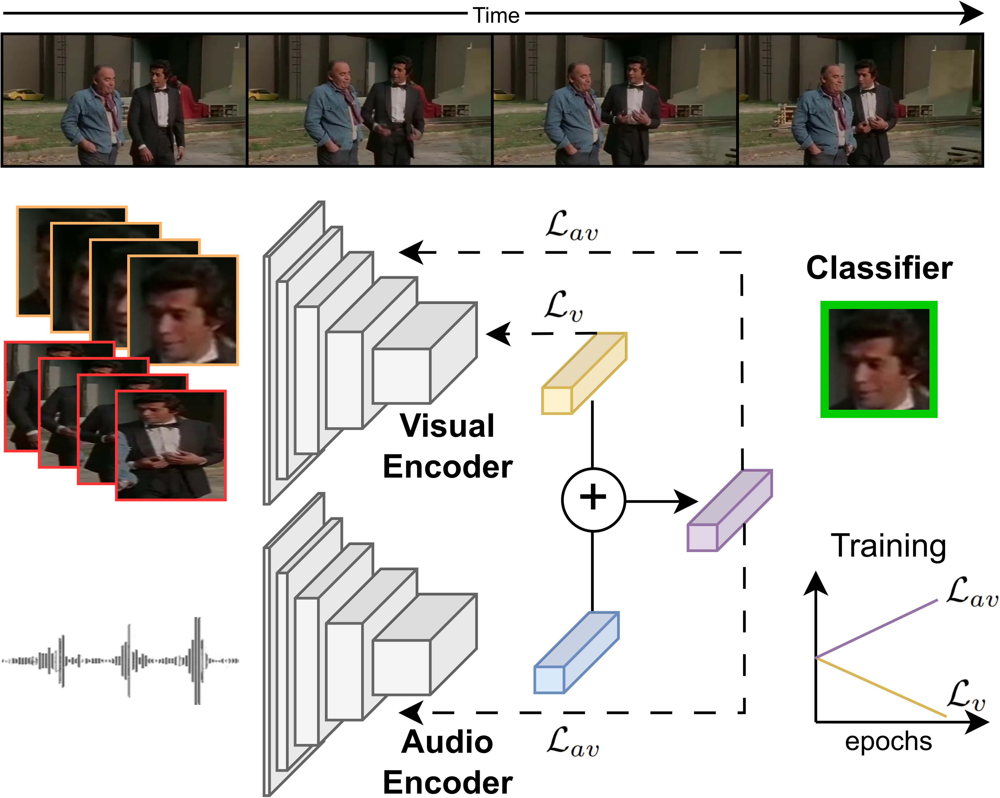
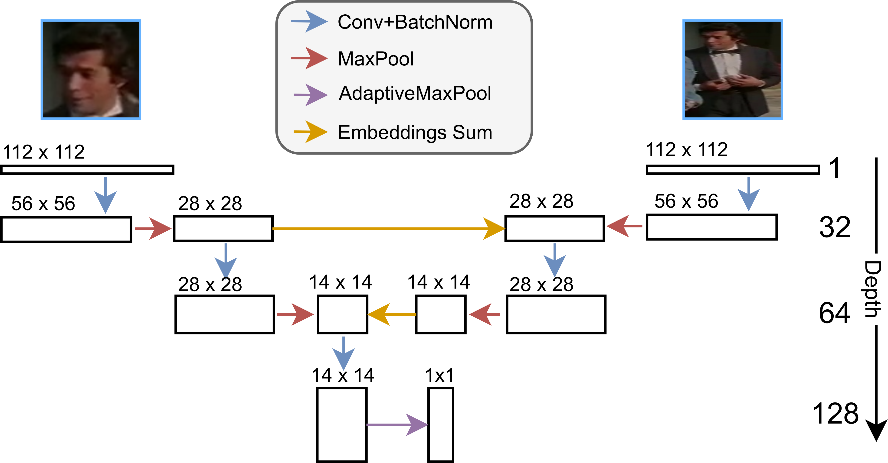

# ASDnB: Merging Face with Body Cues For Robust Active Speaker Detection

*Official Pytorch implementation of the [ASDnB: Merging Face with Body Cues For Robust Active Speaker Detection]()*

We propose ASDnB, a model that singularly integrates face with body information by merging the inputs at different steps of feature extraction. Our approach splits 3D convolution into 2D and 1D to reduce computation cost without loss of performance, and is trained with adaptive weight feature importance for improved complement of face with body data. Our experiments show that ASDnB achieves state-of-the-art results in the benchmark dataset (AVA-ActiveSpeaker [\[github\]](https://github.com/cvdfoundation/ava-dataset) [\[website\]](https://research.google.com/ava/download.html#ava_active_speaker_download)), in the challenging data of [WASD](https://tiago-roxo.github.io/WASD/), and in cross-domain settings using [Columbia](https://link.springer.com/chapter/10.1007/978-3-319-46454-1_18).



*Overview of the ASDnB~architecture. Body and face data are fed into the visual encoder, allowing intra encoder feature fusion and complement, while audio is processed through its respective encoder. Audio and visual features are combined to predict subject speaking label, using an adaptive weighted loss for combined and visual features (L_{av} and L_{v}, respectively).*


*Overview of the flow of face and body combination in ASDnB visual encoder. The first convolution for both inputs downsamples via stride.*


## AVA-ActiveSpeaker and WASD

1. Download the AVA-ActiveSpeaker [\[github\]](https://github.com/cvdfoundation/ava-dataset) [\[website\]](https://research.google.com/ava/download.html#ava_active_speaker_download) and [WASD](https://tiago-roxo.github.io/WASD/) datasets;
2. Create the environment with `conda` using the script `create_env.sh`;
3. To train the model, execute the command:
```bash
python3 main.py --dataPath $DATASET
```
where `$DATASET` is the folder containing the dataset (AVA-ActiveSpeaker or WASD). Alternatively, you can run the script `train.sh` which contains an example of training the model in WASD. After each epoch, the model weights will be saved and output its predictions to a CSV (`val_res.csv`), in the `exps/wasd` folder (by default);

4. To evaluate the model, execute the command:
```bash
python3 main.py --dataPath $DATASET --evaluation
```
where `$DATASET` is the folder containing the dataset (AVA-ActiveSpeaker or WASD). Alternatively, you can run the script `infer.sh` which contains an example of evaluating the model in WASD. The model predictions are saved in a CSV (`val_res.csv`), in the `exps/wasd` folder (by default).

The ASDnB model **trained on WASD** can be downloaded [here]().

The ASDnB model **trained on AVA-ActiveSpeaker** can be downloaded [here]().


### AVA-ActiveSpeaker Performance

Comparison of ASDnB with state-of-the-art models in AVA-ActiveSpeaker.

| Model                                                        | Audio Encoder | Visual Encoder | Parameters (M) | Pre-training | End-to-End | Body Data | mAP        |
|:-------------------------------------------------------------|:-------------:|:--------------:|:--------------:|:------------:|:----------:|:---------:|:----------:|
| [ASC](https://github.com/fuankarion/active-speakers-context) | RN18 2D       | RN18 2D        | 23.3           | ✓            | ×          | ×         | 87.1       |
| [MAAS](https://github.com/fuankarion/MAAS)                   | RN18 2D       | RN18 2D        | 21.7           | ✓            | ×          | ×         | 88.8       |
| [UniCon](https://unicon-asd.github.io/)          			   | RN18 2D       | RN18 2D        | 23.8           | ✓            | ×          | ×         | 92.2       |
| [TalkNet](https://github.com/TaoRuijie/TalkNet-ASD)          | SE-RN34       | RN18+V-TCN     | 15.0           | ×            | ✓          | ×         | 92.3       |
| [BIAS](https://github.com/Tiago-Roxo/BIAS)                   | SE-RN34       | RN18+V-TCN     | 31.6           | ×            | ✓          | ✓         | 92.4       |
| [ASD-Trans](https://ieeexplore.ieee.org/document/9746991)    | RN18 2D       | RN18+V-TCN     | 15.0           | ×            | ✓          | ×         | 93.0       |
| [ASDNet](https://github.com/okankop/ASDNet)                  | SincDsNet     | RNx101 3D      | 49.7           | ✓            | ×          | ×         | 93.5       |
| [TS-TalkNet](https://github.com/Jiang-Yidi/TS-TalkNet)       | SE-RN34       | RN18+V-TCN     | 36.8           | ×            | ✓          | ×         | 93.9       |
| [EASEE-50](https://arxiv.org/pdf/2203.14250v2.pdf)           | RN50          | RN50 3D        | 74.7           | ✓            | ✓          | ×         | 94.1       |
| [Light-ASD](https://github.com/Junhua-Liao/Light-ASD)        | Conv 1D       | Conv 2D-1D     | 1.0            | ×            | ✓          | ×         | 94.1       |
| [SPELL](https://github.com/SRA2/SPELL)           			   | RN18 2D       | RN18+TSM       | 22.5           | ✓            | ×          | ×         | 94.2       |
| **ASDnB**           										   | RN18 2D       | Conv 2D-1D     | 2.2            | ✓            | ✓          | ✓         | 94.6       |


### WASD Performance

Comparison of ASDnB with state-of-the-art models on the different categories of WASD, using the mAP metric. *OC* refers to Optimal Conditions, *SI* to Speech Impairment, *FO* to Face Occlusion, *HVN* to Human Voice Noise, and *SS* to Surveillance Settings.

| Model                                                        | OC        | SI        | FO        | HVN       | SS        | Average |
|:-------------------------------------------------------------|:---------:|:---------:|:---------:|:---------:|:---------:|:-------:|
| [ASC](https://github.com/fuankarion/active-speakers-context) | 91.2      | 92.3      | 87.1      | 66.8      | 72.2      | 85.7    |
| [MAAS](https://github.com/fuankarion/MAAS)                   | 90.7      | 92.6      | 87.0      | 67.0      | 76.5      | 86.4    |
| [ASDNet](https://github.com/okankop/ASDNet)                  | 96.5      | 97.4      | 92.1      | 77.4      | 77.8      | 92.0    |
| [TalkNet](https://github.com/TaoRuijie/TalkNet-ASD)          | 95.8      | 97.5      | 93.1      | 81.4      | 77.5      | 92.3    |
| [TS-TalkNet](https://github.com/TaoRuijie/TalkNet-ASD)       | 96.8      | 97.9      | 94.4      | 84.0      | 79.3      | 93.1    |
| [Light-ASD](https://github.com/Junhua-Liao/Light-ASD)        | 97.8      | 98.3      | 95.4      | 84.7      | 77.9      | 93.7    |
| [BIAS](https://github.com/Tiago-Roxo/BIAS)                   | 97.8      | 98.4      | 95.9      | 85.6      | 82.5      | 94.5    |
| **ASDnB**           										   | 98.7      | 98.9      | 97.2      | 89.5      | 82.7      | 95.6    |


## Columbia

The results for [Columbia dataset](https://link.springer.com/chapter/10.1007/978-3-319-46454-1_18) were obtained using the evaluation tool available at [Light-ASD](https://github.com/Junhua-Liao/Light-ASD). You can obtain the dataset already preprocessed with face and body bounding boxes [here](https://drive.google.com/file/d/1nZoMoTq_bmMl1PiPttmbuL_oC19jhVrR/view?usp=sharing).

To evaluate the model, execute the command:
```bash
python3 Columbia_infer.py --videoFolder $DATASET
```
where `$DATASET` is the folder containing the dataset (Columbia). Alternatively, you can run the script `infer_Columbia.sh` which contains an example of evaluating the model in Columbia.

The ASDnB model **for Columbia** can be downloaded [here]().


### Columbia Performance

Comparison of F1-Score (%) on the Columbia dataset.

| Model                                                        | Bell      | Boll      | Lieb      | Long      | Sick      | Average |
|:-------------------------------------------------------------|:---------:|:---------:|:---------:|:---------:|:---------:|:-------:|
| [TalkNet](https://github.com/TaoRuijie/TalkNet-ASD)          | 43.6      | 66.6      | 68.7      | 43.8      | 58.1      | 56.2    |
| [LoCoNet](https://github.com/SJTUwxz/LoCoNet_ASD)            | 54.0      | 49.1      | 80.2      | 80.4      | 76.8      | 68.1    |
| [Light-ASD](https://github.com/Junhua-Liao/Light-ASD)        | 82.7      | 75.7      | 87.0      | 74.5      | 85.4      | 81.1    |
| [BIAS](https://github.com/Tiago-Roxo/BIAS)                   | 89.3      | 75.4      | 92.1      | 88.8      | 88.6      | 86.8    |
| **ASDnB**           										   | 91.6      | 81.2      | 93.1      | 91.7      | 90.6      | 89.6    |


## Cite

```bibtex

```
